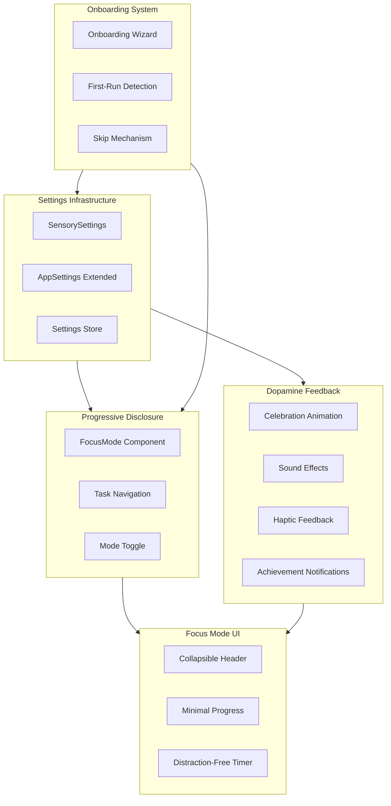
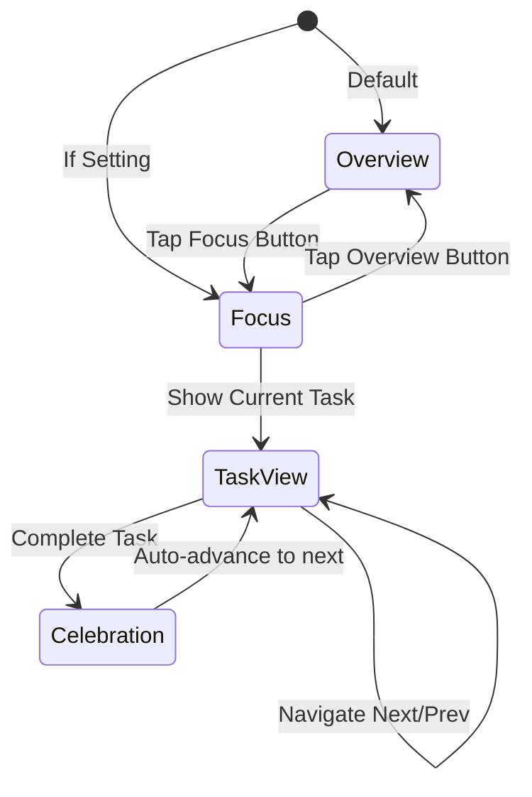
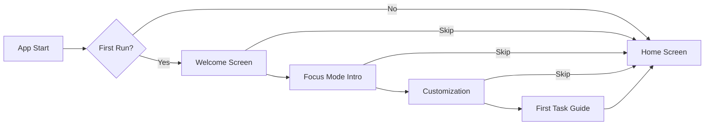

# ADHD-Friendly Optimization Plan for RoutineOS

## Executive Summary

This plan outlines a comprehensive overhaul of RoutineOS to create an optimized, ADHD-friendly experience. The design balances aesthetic appeal with simplicity, utilizing colorful UI and smooth animations for dopamine-inducing feedback while implementing strict progressive disclosure patterns.

## Core Philosophy

Following the principles in `AGENTS.md`:
- **KISS**: Simplest implementation that solves the problem
- **CLEAN Code**: Self-documenting, meaningful naming
- **DRY**: Reusable components and shared utilities
- **YAGNI**: Only what is currently required

## Current State Analysis

### Existing ADHD-Friendly Features
1. **One active task exclusivity** - Only one entry can be "active" per day
2. **Skippable check-ins** - Completion check-in can be skipped
3. **Timer persistence** - State survives page reloads
4. **Vibration notification** - Timer completion triggers haptic feedback
5. **Audio notification** - Timer completion plays a sound
6. **Auto-scroll to active task** - Visual focus on current task

### Areas for Improvement
1. **All tasks visible at once** - Overwhelming for ADHD users
2. **Limited customization** - Only 2 settings currently
3. **No celebration feedback** - Missing dopamine hits on completion
4. **No onboarding** - Users must discover features
5. **No focus mode** - Cannot hide non-essential UI

---

## Architecture Overview



---

## Phase 1: Settings Infrastructure

### 1.1 Extended AppSettings Type

**File**: [`src/lib/utils/settings.ts`](src/lib/utils/settings.ts:1)

```typescript
export interface SensorySettings {
  // Sound preferences
  soundEnabled: boolean
  soundVolume: number // 0-100
  completionSound: 'chime' | 'bell' | 'pop' | 'none'
  
  // Haptic preferences  
  hapticEnabled: boolean
  hapticIntensity: 'light' | 'medium' | 'strong'
  
  // Animation preferences
  animationsEnabled: boolean
  animationSpeed: 'slow' | 'normal' | 'fast'
  celebrationStyle: 'confetti' | 'particles' | 'minimal' | 'none'
  
  // Visual preferences
  colorTheme: 'vibrant' | 'muted' | 'monochrome'
  highContrastMode: boolean
}

export interface AppSettings {
  // Existing
  askCompletionCheckIn: boolean
  showFeedbackOnHome: boolean
  
  // New
  sensory: SensorySettings
  defaultViewMode: 'focus' | 'overview'
  showOnboarding: boolean
  compactHeader: boolean
}
```

### 1.2 Settings Store

Create a reactive settings store that components can subscribe to:

**File**: `src/lib/utils/settings-store.ts`

```typescript
// Settings stored in localStorage
// Components read via loadSettings() 
// Updates propagate through React state in HomeClient
```

### 1.3 Settings UI Updates

**File**: [`src/components/routine/settings-client.tsx`](src/components/routine/settings-client.tsx:1)

New sections:
- **Sensory Preferences** - Sound, haptic, animation toggles
- **Visual Theme** - Color theme selector, contrast options
- **View Preferences** - Default mode, header style

---

## Phase 2: Progressive Disclosure

### 2.1 FocusMode Component

**File**: `src/components/routine/focus-mode.tsx`

A new view mode that shows ONE task at a time:



**Key Features**:
- Single task card centered on screen
- Large, prominent action buttons
- Minimal progress indicator (dots or percentage)
- Swipe/keyboard navigation between tasks

### 2.2 Task Navigation

**Component**: Part of FocusMode

- Previous/Next buttons
- Keyboard shortcuts (arrow keys)
- Touch swipe gestures
- Progress dots showing position in list

### 2.3 Mode Toggle

**Location**: Header in [`HomeClient`](src/components/routine/home-client.tsx:23)

- Toggle button: Focus icon / Grid icon
- Persists preference to settings
- Smooth transition between modes

---

## Phase 3: Dopamine Feedback

### 3.1 Celebration Animation

**File**: `src/components/routine/celebration.tsx`

**Animation Styles**:
1. **Confetti** - Colorful particles bursting from center
2. **Particles** - Subtle sparkles around the card
3. **Minimal** - Pulse effect on the card
4. **None** - No animation (for sensory-sensitive users)

**Implementation**:
- Use Framer Motion for animations
- Respect `prefers-reduced-motion`
- Duration tied to animation speed setting

### 3.2 Sound Effects System

**File**: `src/lib/utils/sounds.ts`

```typescript
interface SoundEffect {
  name: string
  frequency: number
  duration: number
  type: OscillatorType
  volume: number
}

// Predefined sounds
const SOUNDS = {
  chime: { frequency: 880, duration: 0.3, type: 'sine' },
  bell: { frequency: 523, duration: 0.5, type: 'triangle' },
  pop: { frequency: 1200, duration: 0.1, type: 'square' },
}
```

**Integration Points**:
- Task completion
- Timer finish
- Achievement unlock
- Streak milestone

### 3.3 Haptic Feedback

**File**: `src/lib/utils/haptics.ts`

```typescript
const HAPTIC_PATTERNS = {
  light: [50],
  medium: [100],
  strong: [50, 30, 100],
  celebration: [50, 30, 50, 30, 100],
}
```

**Usage**:
- Button presses
- Task completion
- Navigation changes
- Error states

### 3.4 Achievement Notifications

**File**: `src/components/routine/achievement-toast.tsx`

**Triggers**:
- First task of the day completed
- All tasks completed
- Streak milestones (3, 7, 14, 30 days)
- Early completion (before scheduled time)

**Design**:
- Slide in from top
- Auto-dismiss after 3 seconds
- Swipe to dismiss
- Optional sound/haptic

---

## Phase 4: Focus Mode UI

### 4.1 Collapsible Header

**Modification**: [`HomeClient`](src/components/routine/home-client.tsx:23)

- Header collapses to thin bar on scroll down
- Expands on scroll up
- Settings toggle for always-collapsed

### 4.2 Minimal Progress Indicator

**File**: `src/components/routine/focus-progress.tsx`

**Design Options**:
- Dot indicators (one dot per task)
- Circular progress ring
- Simple percentage text

### 4.3 Distraction-Free Timer

**Modification**: [`Timer`](src/components/routine/timer.tsx:12)

In focus mode:
- Larger time display
- Minimal buttons (just pause/resume)
- Full-screen option
- Breathing animation while running

---

## Phase 5: Onboarding

### 5.1 Onboarding Wizard

**File**: `src/components/routine/onboarding-wizard.tsx`

**Steps** (each skippable):
1. **Welcome** - "Welcome to RoutineOS" with skip option
2. **Focus Mode** - Explain the two view modes
3. **Customization** - Quick sensory preferences setup
4. **First Task** - Guide to complete first task



### 5.2 First-Run Detection

**File**: `src/lib/utils/first-run.ts`

```typescript
function isFirstRun(): boolean {
  return !localStorage.getItem('routineos-onboarded')
}

function markOnboarded(): void {
  localStorage.setItem('routineos-onboarded', 'true')
}
```

### 5.3 Skip Mechanism

Every onboarding step has:
- "Skip" button in top-right
- "Skip all" option on first step
- Progress saved if partially completed

---

## Phase 6: Polish

### 6.1 Smooth Transitions

- Mode switches (focus/overview)
- Task navigation
- Completion animations
- Settings changes

### 6.2 Skippable Secondary Interactions

Audit all interactions:
- Completion check-in: Already skippable
- Onboarding: All steps skippable
- Achievement toasts: Swipe to dismiss
- Feedback section: Collapsible

### 6.3 Accessibility

- `prefers-reduced-motion` respected
- `prefers-contrast` respected
- Keyboard navigation throughout
- Screen reader announcements for achievements

---

## File Structure

```
src/
  components/
    routine/
      block-card.tsx          # Modified: Add celebration trigger
      celebration.tsx         # NEW: Celebration animations
      achievement-toast.tsx   # NEW: Achievement notifications
      focus-mode.tsx          # NEW: Single-task view
      focus-progress.tsx      # NEW: Minimal progress indicator
      home-client.tsx         # Modified: Add mode toggle, onboarding
      onboarding-wizard.tsx   # NEW: Onboarding flow
      timer.tsx               # Modified: Focus mode enhancements
  lib/
    utils/
      haptics.ts              # NEW: Vibration patterns
      settings.ts             # Modified: Extended settings
      sounds.ts               # NEW: Sound effects
      first-run.ts            # NEW: First run detection
```

---

## Implementation Order

1. **Settings Infrastructure** - Foundation for all features
2. **Progressive Disclosure** - Core UX change
3. **Dopamine Feedback** - Enhancement layer
4. **Focus Mode UI** - Refinements
5. **Onboarding** - Discovery layer
6. **Polish** - Final touches

---

## Success Criteria

- [ ] Users can switch between focus and overview modes
- [ ] Focus mode shows exactly one task at a time
- [ ] All sensory feedback is customizable
- [ ] All secondary interactions are skippable
- [ ] Onboarding is available but never forced
- [ ] Celebrations provide dopamine without overwhelming
- [ ] Settings persist across sessions
- [ ] Accessibility standards maintained