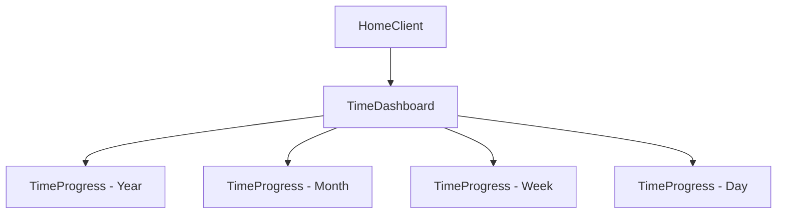
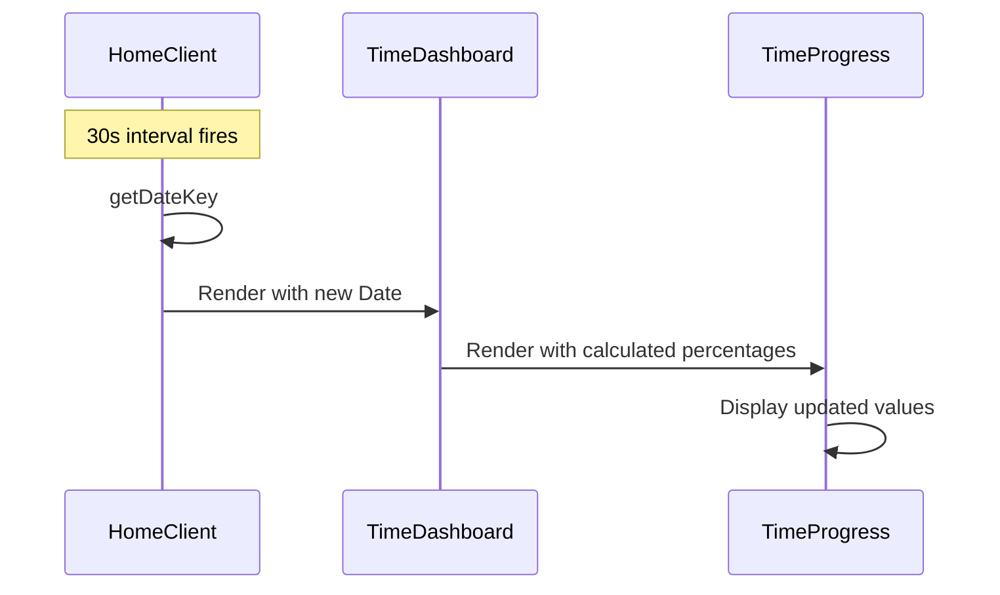

# Dashboard Overview Component Architecture

## Summary

Design for a collapsible dashboard section that displays time-based progress bars (year, month, week, day) integrated into the existing home view. Uses the 30-second refresh cycle and shows percentage only.

---

## Component Structure

### File Organization

```
src/
├── components/
│   └── routine/
│       ├── time-progress.tsx       # New: Individual time progress bar component
│       ├── time-dashboard.tsx      # New: Collapsible dashboard container
│       ├── progress-bar.tsx        # Existing: Task progress (unchanged)
│       └── home-client.tsx         # Modified: Integrate TimeDashboard
└── lib/
    └── utils/
        └── time-progress.ts        # New: Progress calculation utilities
```

### Component Hierarchy



---

## Progress Calculation Logic

### Formulas

All calculations use the current timestamp and return a percentage value from 0 to 100.

#### Year Progress

```
yearProgress = (elapsedMsInYear / totalMsInYear) * 100

Where:
- elapsedMsInYear = now - startOfYear
- totalMsInYear = endOfYear - startOfYear (accounts for leap years)
```

#### Month Progress

```
monthProgress = (elapsedMsInMonth / totalMsInMonth) * 100

Where:
- elapsedMsInMonth = now - startOfMonth
- totalMsInMonth = endOfMonth - startOfMonth
```

#### Week Progress

```
weekProgress = (elapsedMsInWeek / totalMsInWeek) * 100

Where:
- Week starts on Sunday (day 0) at 00:00:00 local time
- elapsedMsInWeek = now - startOfWeek
- totalMsInWeek = 7 * 24 * 60 * 60 * 1000 (always 7 days)
```

#### Day Progress

```
dayProgress = (elapsedMsInDay / totalMsInDay) * 100

Where:
- elapsedMsInDay = (hours * 3600 + minutes * 60 + seconds) * 1000
- totalMsInDay = 24 * 60 * 60 * 1000
```

### Utility Functions

```typescript
// src/lib/utils/time-progress.ts

interface TimeProgressResult {
  percentage: number      // 0-100, rounded to 1 decimal place
}

function getYearProgress(now: Date): TimeProgressResult
function getMonthProgress(now: Date): TimeProgressResult
function getWeekProgress(now: Date): TimeProgressResult
function getDayProgress(now: Date): TimeProgressResult

// Convenience function to get all at once
function getAllTimeProgress(now: Date): {
  year: TimeProgressResult
  month: TimeProgressResult
  week: TimeProgressResult
  day: TimeProgressResult
}
```

---

## Component Specifications

### TimeProgress Component

**Purpose:** Renders a single progress bar with label and percentage.

**Props:**
```typescript
interface TimeProgressProps {
  label: string        // e.g., "Ano", "Mês", "Semana", "Dia"
  percentage: number   // 0-100
}
```

**Behavior:**
- Displays label on the left, percentage on the right
- Uses DaisyUI progress bar styling (consistent with existing ProgressBar)
- Percentage displayed as whole number (e.g., "45%")

**UI Text (Portuguese):**
| Period | Label |
|--------|-------|
| Year | Ano |
| Month | Mês |
| Week | Semana |
| Day | Dia |

### TimeDashboard Component

**Purpose:** Collapsible container for all time progress bars.

**Props:**
```typescript
interface TimeDashboardProps {
  now: Date    // Current time, passed from parent
}
```

**State:**
```typescript
const [isExpanded, setIsExpanded] = useState(false)
```

**Behavior:**
- Collapsed: Shows only a toggle button/header
- Expanded: Shows all four TimeProgress components in a vertical stack
- Toggle state persists across 30-second refreshes (local component state)
- Uses motion/react for smooth expand/collapse animation

**Layout:**
```
┌─────────────────────────────────────┐
│ [▼] Progressão do Tempo             │  <- Header (clickable)
├─────────────────────────────────────┤
│ Ano                    ████████░░  │
│ 78%                                 │
│                                     │
│ Mês                    ██████████░ │
│ 92%                                 │
│                                     │
│ Semana                 █████░░░░░░ │
│ 45%                                 │
│                                     │
│ Dia                    ████░░░░░░░ │
│ 38%                                 │
└─────────────────────────────────────┘
```

---

## Integration Strategy

### HomeClient Modifications

1. **Add TimeDashboard above the main content:**
   - Position: Below header, above routine cards
   - Pass current Date object derived from existing dateKey state

2. **Leverage existing 30-second interval:**
   - The existing `setInterval` in HomeClient already triggers every 30 seconds
   - TimeDashboard receives updated `now` prop on each cycle
   - No additional timers needed

3. **State flow:**


### Code Changes to HomeClient

```typescript
// Add import
import { TimeDashboard } from "@/components/routine/time-dashboard"

// In the return JSX, add after header:
<main className="space-y-3">
  <TimeDashboard now={new Date()} />  {/* Add here */}
  
  <AnimatePresence initial={false}>
    {/* existing block cards */}
  </AnimatePresence>
</main>
```

---

## UI/UX Recommendations

### Visual Design

1. **Consistency with existing ProgressBar:**
   - Use same card styling: `card border border-base-300 bg-base-200/70 shadow-sm`
   - Use same progress bar: `progress progress-primary`
   - Maintain spacing consistency

2. **Collapsed state appearance:**
   - Show a subtle header with chevron icon
   - Text: "Progressão do Tempo" (Time Progression)
   - Chevron rotates on expand/collapse

3. **Expanded state appearance:**
   - Each progress bar in its own row
   - Compact layout to not overwhelm the main routine view
   - Consider using a smaller text size than the task ProgressBar

### Interaction Design

1. **Toggle behavior:**
   - Click anywhere on header to toggle
   - Smooth animation using Framer Motion
   - Default state: collapsed (YAGNI - user opens when interested)

2. **No additional controls needed:**
   - No settings, no configuration
   - Purely informational display

### Accessibility

- Toggle button should have `aria-expanded` attribute
- Progress bars should have `aria-valuenow`, `aria-valuemin`, `aria-valuemax`
- Labels should be properly associated with progress bars

---

## Implementation Checklist

When implementing, follow this order:

1. [ ] Create `src/lib/utils/time-progress.ts` with calculation functions
2. [ ] Create `src/components/routine/time-progress.tsx` component
3. [ ] Create `src/components/routine/time-dashboard.tsx` component
4. [ ] Integrate TimeDashboard into HomeClient
5. [ ] Test all progress calculations at various times
6. [ ] Verify 30-second refresh updates the display
7. [ ] Test expand/collapse animation

---

## Technical Notes

### Time Zone Handling

- All calculations use local time (user's browser timezone)
- This is consistent with existing date handling in the app
- No UTC conversion needed

### Leap Year Consideration

- Year progress calculation must account for leap years
- Use `new Date(year, 1, 29).getDate() === 29` to detect leap year
- Or calculate total days: 365 or 366

### Performance

- Calculations are lightweight (no database queries)
- useMemo in TimeDashboard to prevent unnecessary recalculations
- No impact on existing 30-second refresh cycle

### Edge Cases

- Day progress at midnight: 0%
- Day progress at 23:59:59: ~99.9%
- Week progress on Sunday 00:00: 0%
- Week progress on Saturday 23:59: ~99.9%
- Month/year transitions handled correctly by Date arithmetic
